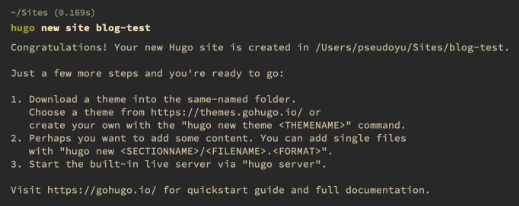
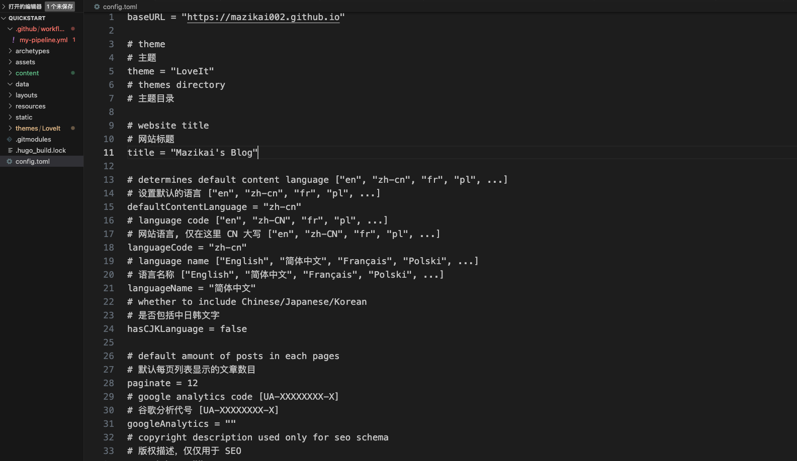
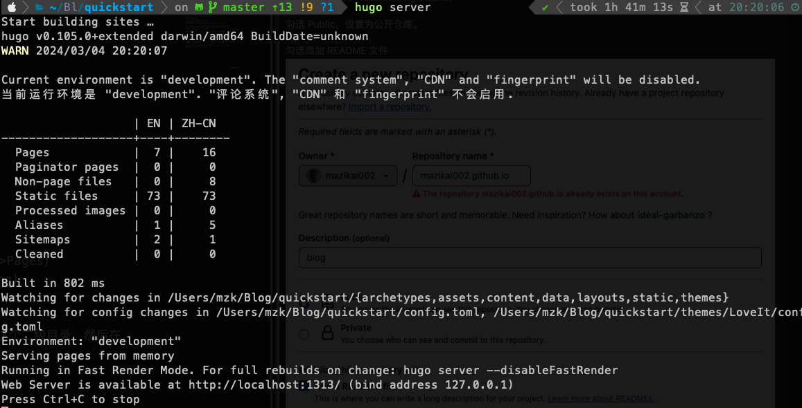
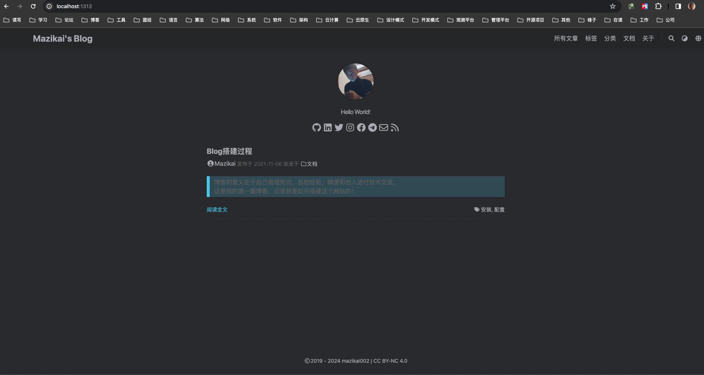
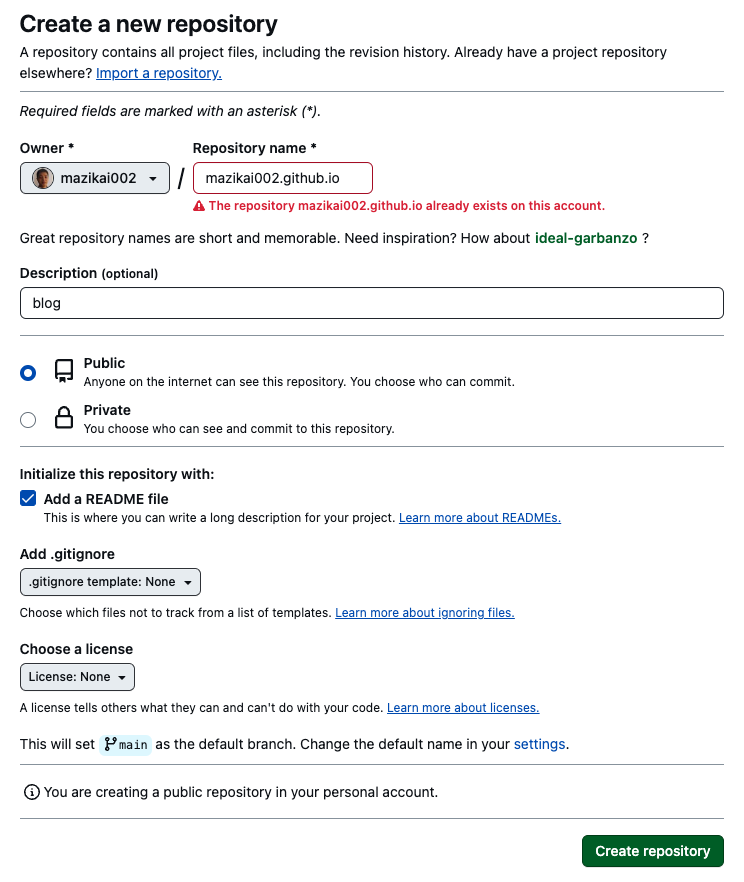
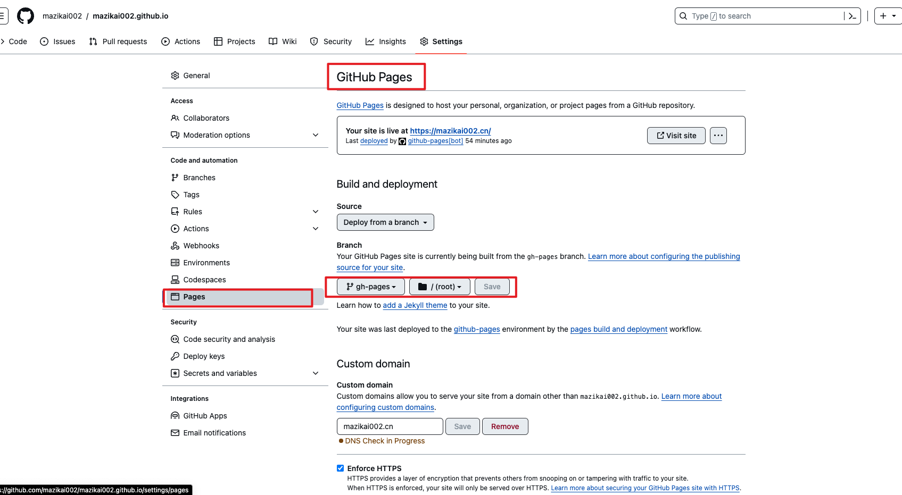
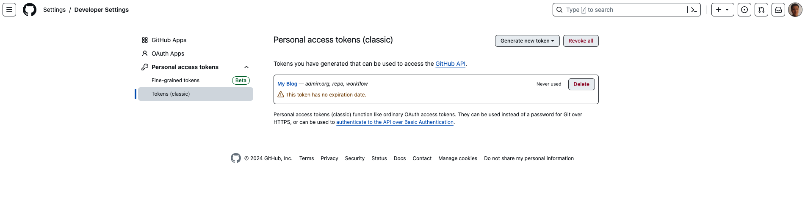
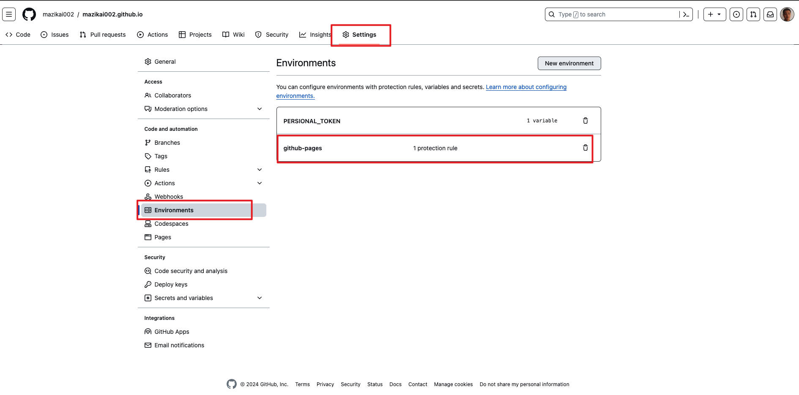
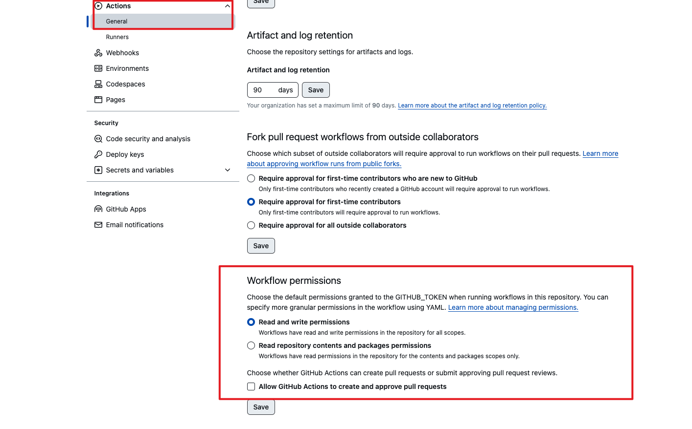
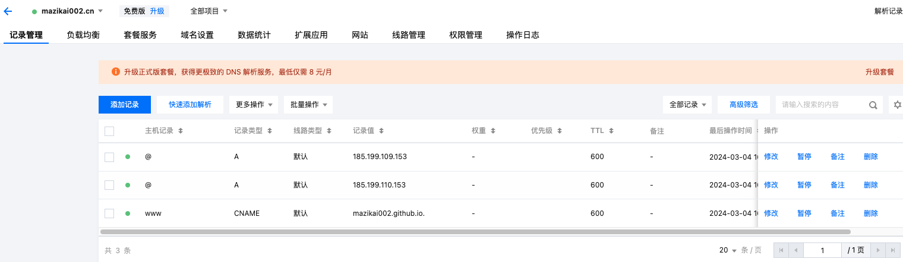

>博客的意义在于自己梳理知识，总结经验，顺便和他人进行技术交流。</br>
>这是我的第一篇博客，记录我是如何搭建这个网站的！希望对您也有帮助~

<!--more-->
</br>

## 所需工具
### **Hugo + GitHub Pages + GitHub Actions + DomainRegistration**

## 1 概念

### 1.1 什么是 Hugo？</br>
Hugo 是用 Go 语言写的静态网站生成器（Static Site Generator）。可以把 Markdown 文件转化成 HTML 文件。

### 1.2 什么是 GitHub Pages？</br>
GitHub Pages 是一组静态网页集合（Static Web Page），这些静态网页 HTML 文件由 GitHub 托管（host）和发布，所以是 GitHub + Pages。

### 1.3 Github Action</br>
Hugo 都是静态博客，即最终生成的是静态页面，而所谓部署就是把这些静态文件放到 web 服务器(比如 Nginx、Caddy) 的对应目录就行了。</br>
因此整个 Github Action 只需要做两件事：</br>
&emsp;1）编译，生成静态文件</br>
&emsp;2）部署，把静态文件移动到合适的位置</br>
&emsp;&emsp;&emsp;- 比如放到某个云服务器上</br>
&emsp;&emsp;&emsp;- 或者放到 Github Pages</br>
然后我们再通过 git push 来触发 Github Action 就可以了。

## 2 过程 #
### 2.1 配置Hugo
#### 2.1.1 安装Hugo</br>
这里使用包管理器安装 Hugo，我的操作系统是 Mac OS，所以使用 Homebrew 安装 Hugo。如果你使用的是 Windows 或 Linux，可以根据 Hugo 文档提示的方式安装： Hugo 文档：Install Hugo
```bash
brew install hugo

# 查看 Hugo 是否安装成功，显示 Hugo 版本号代表 Hugo 安装成功。
hugo version
```
#### 2.1.2 创建 Hugo 网站</br>
通过上述命令安装 hugo 程序后，就可以通过 hugo new site 命令进行网站创建、配置与本地调试了。
```bash
hugo new site Blog
```
</br>
#### 2.1.3 配置主题</br>
当通过上文命令创建我们的站点后，需要进行主题配置，Hugo 社区有了很丰富的主题，可以通过官网 Themes 菜单选择自己喜欢的风格，查看预览效果，选择后可以进入主题项目仓库，一般都会有很详细的安装及配置说明。下面我就以我目前在使用的 LoveIt 这个主题为例，演示一下配置流程。

我们可以将主题仓库直接 git clone 下来进行使用，但这种方式有一些弊端，当之后自己对主题进行修改后，可能会与原主题产生一些冲突，不方便版本管理与后续更新。我采用的是将原主题仓库 fork 到自己的账户，并使用 git submodule 方式进行仓库链接，这样后续可以对主题的修改进行单独维护。
```bash
cd blog-test/
git init
git submodule add https://github.com/pseudoyu/LoveIt themes/LoveIt
```
每个主题一般都会提供一些实例配置与初始页面，开始使用主题时可以将其 exampleSite/ 目录下的文件复制到站点目录下，在此基础上进行调整配置。
```bash
cp -rf themes/LoveIt/exampleSite/* ./
```
初始化主题基础配置后，我们可以在 config.toml 文件中进行站点细节配置，具体配置项参考各主题说明文档。

#### 2.1.4 发布文章
完成后，可以通过 hugo new 命令发布新文章。
```bash
hugo new posts/blog-test.md
```
#### 2.1.5 本地调试</br>
Hugo 会生成静态网页，我们在本地编辑调试时可以通过 hugo server 命令进行本地实时调试预览，无须每次都重新生成。
```bash
hugo server
```


运行服务后，我们可以通过浏览器 http://localhost:1313 地址访问我们的本地预览网页。



### 2.2 创建GitHub仓库
>命名博客源仓库（username.github.io）
>
>勾选 Public，设置为公开仓库。
>
>勾选添加 README 文件


### 2.3 创建GitHub Page
>在博客源仓库下创建GitHub Pages（Settings->Pages）


### 2.4 创建GitHub Actions
>需要在仓库根目录下创建 .github/workflows 这个二级目录，然后在 workflows 下以 .yml 形式配置 Github Action。
```yml
name: publish to gh-pages # 流水线名称

on: # on 表示 GitHub Action 触发条件
  push:
    branches:
      - main # main分支

env:
  REGISTRY: ghcr.io
  IMAGE_NAME: ${{ github.repository }}

jobs: # jobs 表示 GitHub Action 中的任务
  build:
    runs-on: ubuntu-latest # runs-on 表示 GitHub Action 运行环境，我们选择了 ubuntu-latest。
    # permissions:
    #   contents: read
    #   packages: write
    concurrency:
      group: ${{ github.workflow }}-${{ github.ref }}

    steps:
      - name: checkout # 检查
        uses: actions/checkout@v2 # uses 中的为 GitHub Action 中的一个插件
        with:
          submodules: true  # Fetch Hugo themes (true OR recursive)
          fetch-depth: 0    # Fetch all history for .GitInfo and .Lastmod

      - name: setup hugo # 安装
        uses: peaceiris/actions-hugo@v2 
        with:
          hugo-version: '0.105.0' # hugo的版本号
          extended: true

      - name: build web # 构建
        run: hugo --minify

      - name: deploy web # 部署
        uses: peaceiris/actions-gh-pages@v3
        if: ${{ github.ref == 'refs/heads/main' }}
        with:
          github_token: ${{ secrets.GH_PAGE_ACTION_TOKEN }}
          publish_dir: ./public
          cname: mazikai002.cn # 重点 ！！！个人域名使用
          # PUBLISH_BRANCH: gh-pages，peaceiris/actions-gh-pages@v3插件默认指定生成分支

```
整个 Action 一个包含 4 个步骤：</br>
1）拉取代码</br>
2）准备 hugo 环境</br>
3）使用 hugo 编译生成静态文件</br>
4）把生成的静态文件发布到 Github Pages</br>
以上需要特别注意的是 Hugo 的版本以及是否启用 hugo 扩展。

因为我们需要从仓库的main分支推送到仓库的gh-pages分支，这需要特定权限，故要在 GitHub 账户下 Setting - Developer setting - Personal access tokens 下创建一个 Token。

权限需要开启admin:org(read write)、repo、workflow三块权限。

配置后复制生成的 Token（注：只会出现一次），然后在我们博客源仓库的 Settings - Secrets and variables - Actions - Environment secrets 中添加 GITHUB_TOKEN 环境变量为刚才的 Token，这样 GitHub Action 就可以获取到 Token 了。

同时 Settings - Actions - General的最下方的一个选项选择Read and write permissions

完成上述配置后，推送代码至仓库，即可触发 GitHub Action，自动生成博客页面并推送至 GitHub Pages 仓库。
### 2.5 博客绑定域名
#### 2.5.1 创建 CNAME
首先在你的库下面添加一个 CNAME （别名记录）文件，建议直接在 GitHub 那创建!(这一步在workflows的yml文件中最后一行已经配置)，参考你的域名进行编写。</br>

#### 2.5.2 添加 DNS 解析

然后是添加解析，我域名是在腾讯云买的，所以直接在腾讯云那添加解析了。</br>
我添加的解析如下,供参考，记得把 username 改成你自己的。
>@   A   185.199.109.153
>
>@   A   185.199.110.153
>
>www   CNAME   username.github.io.
A 记录的 ip 地址可以在下面中选择

>185.199.108.153
>
>185.199.109.153
>
>185.199.110.153
>
>185.199.111.153

#### 2.5.3 修改设置
添加完成后进入库的设置，找到 GitHub Pages ，如果能看到类似  Your site is published at https://mazikai002.cn/ 这样的文字，说明就搞定了。

Enforce HTTPS 最好勾选上，GitHub 提供的这个可以直接让你的网站从 HTTP 升级到 HTTPS，非常赞。

## 3 流程
- 使用hugo创建个人站点，hugo new site，hugo new post...
- git commit 提交
- 触发 github action .github/workflows/my-pipeline.yml 并满足设置中的 on 条件
- 触发 pipeline 中的 steps
  - checkout：相当与 git clone，并且后续操作具有 github 完整权限，可以通过 permissions 设置
  - setup hugo：准备构建要求，安装对应版本，注意是否需要 extended
  - build：构建出静态文件，并输出到 public 文件夹
  - deploy：该插件来自 插件市场
    - 自动创建分支 gh-pages
    - 自动 copy public 到新分支
    - 自动提交
    - 自动生成 CNAME 文件，根据 cname 设置，想要 自定义域名 的注意这里了
- 打开 https://github.com/{你的名字}/{你的仓库}/settings/pages（后续步骤只需要一次）
  - Source 选择 gh-pages ，文件夹: 默认 / (root) ，并 save
  注意上方提示 Your site is ready to be published at https://xxx.github.io/xxx/
  - 将域名部分做 解析
  - Custom domain 设置 自己的域名
  - Enforce HTTPS 点一下，然后等一会

## 4 总结 
可以将主题下相关文件复制到 blog 网站根目录下，因为这样可以直接渲染网站效果，而又不影响主题本身的内容。 主要是 themes\LoveIt\exampleSite 目录下文件。

发布文章如果有参数 draft ，记得将值设为 false，或者删除 draft，不然会被认定为草稿只能本地运行而不能运行到网站上。

Hogo方式搭建博客基本就是安装，建站，下载主题，配置主题参数，编写几大内容。

使用 GitHub Pages + GitHub Actions 方式部署博客可以节省传统的构建部署繁琐步骤，简化搭建博客的过程，让个人博客爱好者更能专注于自身博客的内部撰写，而不用拘泥于博客整体的维护过程，提高效率

## 5. 参考
https://huweicai.com/</br>
https://www.pseudoyu.com/zh/2022/05/29/deploy_your_blog_using_hugo_and_github_action/</br>
https://cuttontail.blog/blog/create-a-wesite-using-github-pages-and-hugo/</br>
https://blog.csdn.net/wolanx/article/details/122857729?spm=1001.2014.3001.5502</br>
https://cloud.tencent.com/developer/article/1421879</br>
https://h1z3y3.me/posts/hugo-auto-deploy-github-with-actions/</br>

