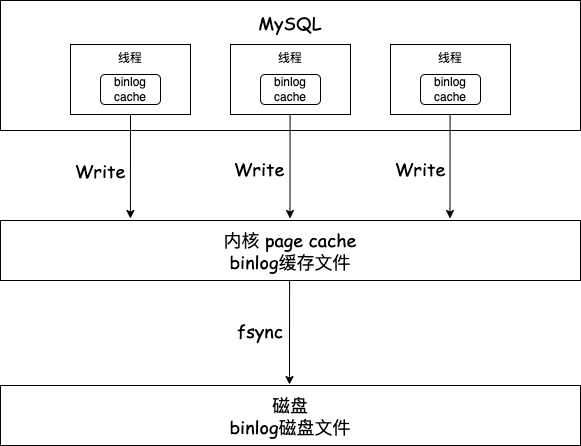

>Binlog主要用于数据备份和主从复制。 
>以下为一些精简内容梳理，希望对您有帮助 ~  

<!--more-->

# 主从复制怎么实现

MySQL的主从复制依赖于binlog，也就是记录MySQL上的所有变化并以二进制形式保存在磁盘上的日志。复制过程就是将binlog中的数据从主库传输到从库上。

### 具体过程

写入Binlog：主库写binlog日志，提交事务并更新本地存储数据。

同步Binlog：主库把binlog日志通过log dump 线程发送到所有从库，从库创建一个专门的I/O线程连接log dump线程接收主库的binlog日志，再把binlog信息写入relay log(中继日志)中，再返回给主库”复制成功”的响应。

回放Binlog：从库会创建一个用于回放binlog的线程，读取relay中继日志，然后回放binlog更新存储引擎中的数据，最终实现主从的数据一致性。

# 主从复制模型（三种）

同步复制：MySQL主库提交事务的线程要等待所有从库的复制响应，才返回客户端结果。

异步复制：MySQL主库提交事务的线程不会等待binlog同步到各从库，就返回客户端结果。

半同步复制：只要数据成功复制到任意一个从库上，主库的事务线程就可以返回客户端结果。

# Binlog刷盘机制

事务执行过程中，先把日志写入binlog cache(Server层的cache)；

事务提交的时候，在把binlog cache中的数据write到binlog文件（缓存中）；

至于binlog什么时候从缓存持久化到磁盘，这个由操作系统决定。

MySQL提供 `sync_binlog` 参数来控住数据库的binlog刷到磁盘上的频率：

1. sync_binlog = 0 （fsync频率由操作系统决定）
2. sync_binlog = 1 （每次提交事务后会fsync）
3. sync_binlog = N（累积 N 个事务后才 fsync）

# 参考
https://www.xiaolincoding.com/mysql/log/how_update.html#binlog-%E4%BB%80%E4%B9%88%E6%97%B6%E5%80%99%E5%88%B7%E7%9B%98