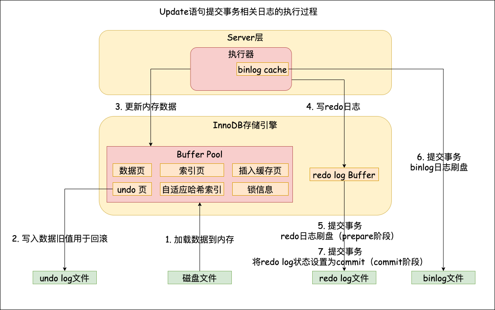
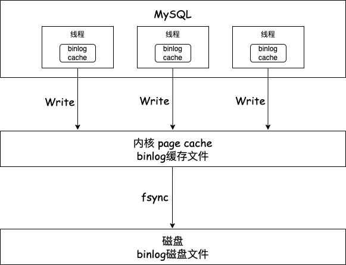

>MySQL日志主要包括错误日志、查询日志、慢查询日志、回滚日志、重做日志、归档日志几大类。 
>本文主要聊一聊MySQL的重要日志，binlog 、redo log 、undo log ！ 
>该部分为作者梳理的精简内容，希望对您有帮助 ~  

<!--more-->

# undo log（回滚日志）
是Innodb存储引擎层生成的日志，实现了事务的原子性，主要用于事务回滚和MVCC。

# redo log（重做日志）
redo log是是Innodb存储引擎层生成的日志，记录了某个数据页做了什么修改，比如对X表空间中的Y数据页Z偏移量的地方做了A更新，每当执行一个事务就会产生一条或多条物理日志。它实现了事务的持久性，主要用于掉电等故障恢复和提高MySQL写入性能(将写操作从随机写变成顺序写)。

# binlog（归档日志）
binlog是Server层生成的逻辑日志，记录内容是原始操作语句，主要用于数据备份和主从复制。

## 记录格式(可以通过 binlog-format 指定)
statement：记录的是SQL语句(MySQL 5.7.7 之前) 
row：记录行的内容，一条更新前，一条更新后(MySQL 5.7.7 之后) 
mixed：混合模式，不推荐使用 

## 主从复制怎么实现

MySQL的主从复制依赖于binlog，也就是记录MySQL上的所有变化并以二进制形式保存在磁盘上的日志。复制过程就是将binlog中的数据从主库传输到从库上。

### 具体过程

写入Binlog：主库写binlog日志，提交事务并更新本地存储数据。

同步Binlog：主库把binlog日志通过log dump 线程发送到所有从库，从库创建一个专门的I/O线程连接log dump线程接收主库的binlog日志，再把binlog信息写入relay log(中继日志)中，再返回给主库”复制成功”的响应。

回放Binlog：从库会创建一个用于回放binlog的线程，读取relay中继日志，然后回放binlog更新存储引擎中的数据，最终实现主从的数据一致性。

## 主从复制模型（三种）

同步复制：MySQL主库提交事务的线程要等待所有从库的复制响应，才返回客户端结果。

异步复制：MySQL主库提交事务的线程不会等待binlog同步到各从库，就返回客户端结果。

半同步复制：只要数据成功复制到任意一个从库上，主库的事务线程就可以返回客户端结果。

## binlog刷盘机制

事务执行过程中，先把日志写入binlog cache(Server层的cache)；

事务提交的时候，在把binlog cache中的数据write到binlog文件（缓存中）；

至于binlog什么时候从缓存持久化到磁盘，这个由操作系统决定。

MySQL提供 `sync_binlog` 参数来控住数据库的binlog刷到磁盘上的频率：

1. sync_binlog = 0 （fsync频率由操作系统决定）
2. sync_binlog = 1 （每次提交事务后会fsync）
3. sync_binlog = N（累积 N 个事务后才 fsync）

# 两阶段提交
## 什么是两阶段提交
## 为什么需要两阶段提交
如果只有 `redo log` 或者只有 `binlog`，那么事务就不需要两阶段提交。但是如果同时使用了 `redo log` 和 `binlog`，那么就需要保证这两种日志之间的一致性。否则，在数据库发生异常重启或者主从切换时，可能会出现主从库数据不一致的情况。
1. redo log ——> 主库数据持久化
2. binlog ——> 从库数据持久化

# 区别不同(binlog、redo log)
1. 日志的提供者 : binlog 由 MySQL Server 提供，redo log 是 InnoDB 引擎特有。
2. 日志的内容 : redo log 主要记录的是某个数据页做了什么修改，binlog 记录的是语句的原始逻辑，比如更新了某一行的某个字段。
3. 使用的方式 : redo log 是循环写的，数据会被覆盖; binlog 是追加写，一个文件写满，就写下一个文件。

# 参考
https://www.xiaolincoding.com/mysql/log/how_update.html#binlog-%E4%BB%80%E4%B9%88%E6%97%B6%E5%80%99%E5%88%B7%E7%9B%98 
https://zhuanlan.zhihu.com/p/358573128 
https://blog.csdn.net/weixin_63566550/article/details/129819638 