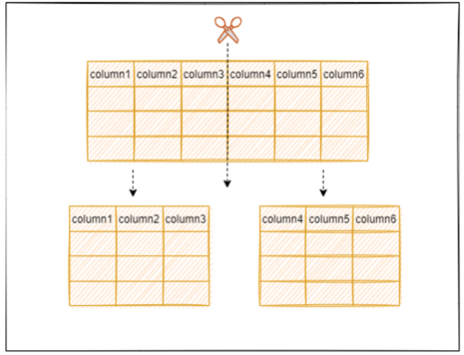
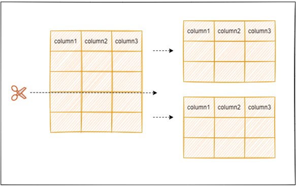

>分库分表 

<!--more-->

# 切分目的

当单表的数据量达到1000W或100G以后，优化索引、添加从库等可能对数据库性能提升效果不明显，此时就要考虑对其进行切分了。切分的目的是为了减少数据库的负担，缩短查询的时间。

### 表垂直拆分

- 优点：列数据变小，数据页可以存放更多数据，在查询时减少I/O次数
- 缺点：主键冗余、连表操作（JOIN）、行数据大

### 表水平拆分

- 优点：行数据变小；切分出的表结构相同，程序改动小
- 缺点：连表操作（JOIN）、分片事务一致性难以解决

# 参考
https://zhuanlan.zhihu.com/p/375951738