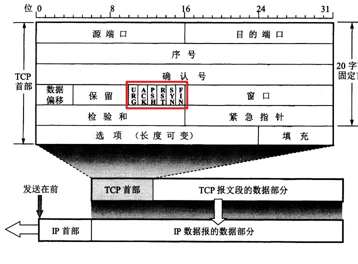

> 很多人可能知道TCP的报文格式，但是当提及报文类型时却一问三不知。  
> 本文梳理了TCP报文类型，希望对您有帮助 ~  

<!--more-->

	

TCP的报文类型是由标志位(code bits)决定的，所以TCP报文类型一共6种。 
在TCP层，有个FLAGS字段，这个字段有以下几个标识：SYN(synchronous建立联机)，ACK(acknowledgement 确认)，PSH(push传送)，FIN(finish结束)，RST(reset重置)，URG(urgent紧急)。它们的含义分别是 :
-  SYN : 建立连接
-  FIN : 关闭连接
-  ACK : 响应连接
-  PSH : 数据传输(只出现在DATA内容不为0的包中)
-  RST : 重置连接(解决TCP异常连接不释放的机制)
-  URG : 紧急发送(此报文段中有紧急数据，应尽快传送)

# 参考
https://www.cnblogs.com/linguoguo/p/15631417.html 
https://juejin.cn/s/tcp%20%E6%8A%A5%E6%96%87%E7%B1%BB%E5%9E%8B 
https://acptek.github.io/2020/07/10/TCP-IP-%E4%BC%A0%E8%BE%93%E6%8E%A7%E5%88%B6%E6%8A%A5%E6%96%87%E5%8D%8F%E8%AE%AE/ 
https://blog.csdn.net/qq_35420908/article/details/72459105 