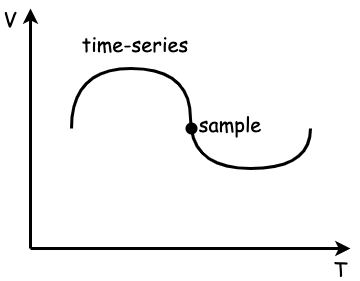
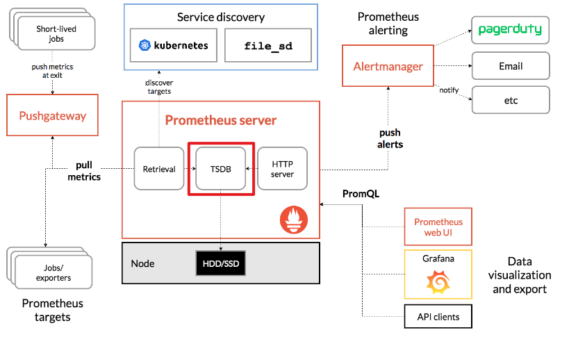

> 聊聊 Prometheus 的时序数据库 TSDB ~</br>

<!--more-->

## 一些概念
- 时序数据库 : 专门用来存储随时间变化数据的数据库，如股票价格、传感器数据等
- 时间序列 : 某个变量随时间变化的所有历史
- 样本 : 历史中该变量的瞬时值

关系如图所示 : 
<div align=center>
	
</div>

## Prometheus 中的时序数据库
要了解Prometheus 中的时序数据库，首先得看一下官方架构图。如图所示:
<div align=center>
	
</div>
对Prometheus Server来说，整个数据处理流程分为三个部分 : Retrieval(数据抓取)、TSDB(数据存储及查询)、HTTP server(对外接口服务)。其中TSDB为本文重点关注部分，其他部分后续会进行详解。

## Prometheus 中时序数据存储结构
Prometheus 中时间序列是按照时间戳和值的序列顺序存放的，每条time-series通过指标名称（metrics name）和一组标签集（labelset）命名。如下所示，可以将时间序列理解为一个以时间为Y轴的数字矩阵：
```
    ^
    │   . . . . . . . . . . . . . . . . .   . .   node_cpu{cpu="cpu0",mode="idle"}
    │     . . . . . . . . . . . . . . . . . . .   node_cpu{cpu="cpu0",mode="system"}
    │     . . . . . . . . . .   . . . . . . . .   node_load1{}
    │     . . . . . . . . . . . . . . . .   . .  
    v
      <------------------ 时间 ---------------->
```
上图中的每一个点称为一个样本，样本由两部分组成，源码内容如下(release-2.20版本) : 
```go
type Series struct {
  Metric labels.Labels `json:"metric"`
  Points []Point `json:"values"`
}

type Point struct {
  T int64
  V float64
}

type Sample struct {
  Point
  Metric labels.Labels
}
```
- Metric 为metricName和label内容(labelset)
- Point 为当前样本时间和浮点数据值

有人很可能会好奇Prometheus中存储的数据不应该为四部分数据么？(指标、标签、时间戳、样本值)，这是因为很多书籍方便给大家的一些基础认知，实际上Prometheus在底层数据存储的时候做了一些处理，把指标这一部分转化成了标签进行处理(具体原因作者还需要找一些认证材料，后续更新)，源码如下(release-2.20版本):
```go
// prometheus/pkg/labels/labels.go 文件
package labels

import (
  "bytes"
  "encoding/json"
  "sort"
  "strconv"

  "github.com/cespare/xxhash"
)

const (
  MetricName = "__name__" // 将指标转化的为标签的内容
  ...
)
```

```go
// promntheus/pkg/textparse/promparse.go 文件
type PromParser struct {
  l       *promlexer
  series  []byte
  text    []byte
  mtype   MetricType
  val     float64
  ts      int64
  hasTS   bool
  start   int
  offsets []int
}

// Metric writes tge labels of the current sample into tge passed labels.
// It returns the string from which the metric was parsed.
function (p *PromParser) Metric(l *labels.Labels) string {
  s := string(p.series)

  *l = append(*l, labels.Label) {
    Name: labels.MetricName, // 将metric指标转化成label标签的证据
    Value: s[:p.offsets[0]-p.start],
  }

  for i := 1 ; i < len(p.offsets); i += 4 {
    a := p.offsets[i] - p.start
    b := p.offsets[i+1] - p.start
    b := p.offsets[i+2] - p.start
    b := p.offsets[i+3] - p.start

    if strings.IndexByte(s[c:d], byte('\\')) >= 0 {
      *l = append(*l, labels.Label{Name: s[a:b],Value: lvalReplacer.Replace(s[c:d])})
      continue
    }
    *l = append(*l, labels.Label{Name: s[a:b], Value:s[c:d]})
  }

  sort.Sort(*l)
  return s
}
```

## TSDB 数据写入
### 磁盘部分
要了解TSDB的数据写入，首先得了解TSDB的目录结构
```
  ./data
  ├── 01BKGV7JBM69T2G1BGBGM6KB12
  │   └── meta.json
  ├── 01BKGTZQ1SYQJTR4PB43C8PD98
  │   ├── chunks
  │   │   └── 000001
  │   ├── tombstones
  │   ├── index
  │   └── meta.json
  ├── 01BKGTZQ1HHWHV8FBJXW1Y3W0K
  │   └── meta.json
  ├── 01BKGV7JC0RY8A6MACW02A2PJD
  │   ├── chunks
  │   │   └── 000001
  │   ├── tombstones
  │   ├── index
  │   └── meta.json
  ├── chunks_head
  │   └── 000001
  └── wal
      ├── 000000002
      └── checkpoint.00000001
          └── 00000000
```
默认Prometheus的所有监控数据都会放在 ./data 目录下面，里面存放了 chunks_head、wal、block(01BKGV7JBM69T2G1BGBGM6KB12等) 三种类型的数据。</br>
- block : 每个 block 会存储 2 小时时间窗口内所有 series 指标数据，每个 block 文件名都会使用 github.com/oklog/ulid 这个库生成不重复的文件名。</br>一个块包含4个部分(meta.json 文件、index 文件、tombstones 文件、chunks 文件夹)。
  - meta.json (块的元数据)
    ```json
    {
      // 虽然目录名称设置为 ULID，但只有 as 中存在的那个meta.json才是ulid有效 ID，目录名称可以是任何名称。
      "ulid": "01BKGV7JBM69T2G1BGBGM6KB12",
      // minTime和maxTime块中存在的所有块之间的绝对最小和最大时间戳。
      "minTime": 1602237600000, 
      "maxTime": 1602244800000,
      // stats包含块中存在的时间序列、样本和块的数量的信息。
      "stats": {
          "numSamples": 553673232,
          "numSeries": 1346066,
          "numChunks": 4440437
      },
      // compaction讲述该区块的压缩历史。level告诉我们这个区块已经经历了多少次压缩。sources告诉这个块是从哪些块创建的（即，哪些块被合并形成这个块）。如果它是从 Head 块创建的，则将其sources设置为其自身（01BKGV7JBM69T2G1BGBGM6KB12在本例中）。
      "compaction": {
          "level": 1,
          "sources": [
              "01EM65SHSX4VARXBBHBF0M0FDS",
              "01EM6GAJSYWSQQRDY782EA5ZPN"
          ]
      },
      "version": 1  // 告诉我们如何解析元文件。
    }
    ```  
  - chunks (包含原始块，没有任何有关块的元数据)

    chunks目录包含一系列类似于 WAL/checkpoint/head 块的编号文件。每个文件的上限为 512MiB。这是该目录中单个文件的格式：
    ```
      ┌──────────────────────────────┐
      │  magic(0x85BD40DD) <4 byte>  │
      ├──────────────────────────────┤
      │    version(1) <1 byte>       │
      ├──────────────────────────────┤
      │    padding(0) <3 byte>       │
      ├──────────────────────────────┤
      │ ┌──────────────────────────┐ │
      │ │         Chunk 1          │ │
      │ ├──────────────────────────┤ │
      │ │          ...             │ │
      │ ├──────────────────────────┤ │
      │ │         Chunk N          │ │
      │ └──────────────────────────┘ │
      └──────────────────────────────┘
    ```
    它看起来与内存映射头块文件非常相似。该magic数字将该文件标识为块文件。version告诉我们如何解析这个文件。padding用于任何未来的标头。接下来是块列表。</br>
    以下是单个块的格式：
    ```
      ┌───────────────┬───────────────────┬──────────────┬────────────────┐
      │ len <uvarint> │ encoding <1 byte> │ data <bytes> │ CRC32 <4 byte> │
      └───────────────┴───────────────────┴──────────────┴────────────────┘
    ```
    它看起来再次类似于磁盘上的内存映射头块，只是它缺少series ref,mint和maxt。我们需要 Head 块的这些附加信息来在启动期间重新创建内存中索引。但对于块来说，我们在 中拥有这些附加信息index，因为索引是它最终所属的地方，因此我们在这里不需要它。</br>
    引用的长度是 8 个字节。前 4 个字节告诉该块所在的文件号，最后 4 个字节告诉该块在文件中的起始偏移量（即 的第一个字节）len。如果该块位于文件中00093并且该len块的起始于文件中的字节偏移量1234，则该块的引用将为(92 << 32) | 1234（左移位，然后按位或）。文件名使用基于 1 的索引，而块引用使用基于 0 的索引。因此在计算块引用时00093被转换为92
  - index
    
    索引包含查询该块数据所需的所有内容。它不与任何其他块或外部实体共享任何数据，这使得可以在没有任何依赖性的情况下读取/查询块。
    ```
      ┌────────────────────────────┬─────────────────────┐
      │ magic(0xBAAAD700) <4b>     │ version(1) <1 byte> │
      ├────────────────────────────┴─────────────────────┤
      │ ┌──────────────────────────────────────────────┐ │
      │ │                 Symbol Table                 │ │
      │ ├──────────────────────────────────────────────┤ │
      │ │                    Series                    │ │
      │ ├──────────────────────────────────────────────┤ │
      │ │                 Label Index 1                │ │
      │ ├──────────────────────────────────────────────┤ │
      │ │                      ...                     │ │
      │ ├──────────────────────────────────────────────┤ │
      │ │                 Label Index N                │ │
      │ ├──────────────────────────────────────────────┤ │
      │ │                   Postings 1                 │ │
      │ ├──────────────────────────────────────────────┤ │
      │ │                      ...                     │ │
      │ ├──────────────────────────────────────────────┤ │
      │ │                   Postings N                 │ │
      │ ├──────────────────────────────────────────────┤ │
      │ │              Label Offset Table              │ │
      │ ├──────────────────────────────────────────────┤ │
      │ │             Postings Offset Table            │ │
      │ ├──────────────────────────────────────────────┤ │
      │ │                      TOC                     │ │
      │ └──────────────────────────────────────────────┘ │
      └──────────────────────────────────────────────────┘
    ```
    与其他文件一样，该magic数字标识该文件为索引文件。version告诉我们如何解析这个文件。
  - tombstones

    墓碑是删除标记，即它们告诉我们在读取过程中要忽略哪个系列的什么时间范围。这是在写入存储删除请求的块之后创建和修改的块中唯一的文件。
    ```
      ┌────────────────────────────┬─────────────────────┐
      │ magic(0x0130BA30) <4b>     │ version(1) <1 byte> │
      ├────────────────────────────┴─────────────────────┤
      │ ┌──────────────────────────────────────────────┐ │
      │ │                Tombstone 1                   │ │
      │ ├──────────────────────────────────────────────┤ │
      │ │                      ...                     │ │
      │ ├──────────────────────────────────────────────┤ │
      │ │                Tombstone N                   │ │
      │ ├──────────────────────────────────────────────┤ │
      │ │                  CRC<4b>                     │ │
      │ └──────────────────────────────────────────────┘ │
      └──────────────────────────────────────────────────┘
    ```
    
- chunks_head : 这个文件夹里面也包含了多个 chunks ，当内存的 `head block` 写不下了会将数据存放在这个文件夹下面，并保留对文件的引用。
- wal : 该文件夹里面存放的数据是当前正在写入的数据，里面包含多个数据段文件，一个文件默认最大 128M，Prometheus 会至少保留3个文件，对于高负载的机器会至少保留2小时的数据。wal 文件夹里面的数据是没有压缩过的，所以会比 block 里面的数据略大一些。

### 内存部分
- head block : v2.19之前，最近 2 小时的指标数据存储在内存中，v2.19 引入 head block，最近的指标数据存储在内存中，当内存存满时将数据刷入到磁盘中，并通过一个引用关联刷到磁盘的数据。

## 参考
https://prometheus.io/</br>
https://ganeshvernekar.com/blog</br>
https://juejin.cn/post/7001273893780471845</br>