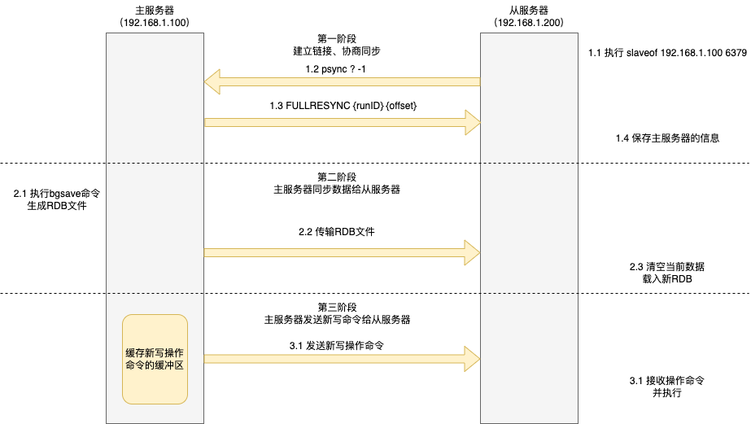

> 所谓的高可用，也叫 HA（High Availability），是分布式系统架构设计中必须考虑的因素之一，它通常指，通过设计减少系统不能提供服务的时间。  
> 本文梳理了Redis高可用的三种模式(主从、哨兵、集群)。希望对您有帮助 ~   

<!--more-->

## 主从模式
### 主从复制怎么实现的
主从复制采用三种方式(全量同步、命令传播、增量同步)配合实现。 
1. 主从服务器第一次同步的时候，采用全量复制，此时主服务器最耗时的两个地方(生成RDB文件、传输RDB文件)。为了避免过多的从服务器和主服务器进行全量复制，可以把一部分从服务器设置成「经理角色」，让它也有自己的从服务器，分摊主服务器的压力。 
2. 第一次同步完成后，主从服务器都会维护一个长连接，主服务器在接收到写操作命令后，会通过这个连接将写命令传播给从服务器，来保证主从服务器的数据一致性。
3. 如果遇到网络断开，增量复制就起到了作用。只不过增量复制和`repl_backlog_size`有关。

#### 全量同步(第一次同步)
全量同步分为三个阶段
1. 第一阶段 : 建立链接、协商同步
2. 第二阶段 : 主服务器同步数据给从服务器
3. 第三阶段 : 主服务器会将 replication buffer 缓冲区新写操作命令发送给从服务器
> 注 : psync 命令包含两个参数，分别是主服务器的 runID 和复制进度 offset。

#### 基于长连接的命令传播
主从服务器在完成第一次同步后，双方之间就会维护一个 TCP 连接。

#### 增量复制

## 哨兵模式

## 集群模式

# 参考
https://cloud.tencent.com/developer/article/1924661 
https://www.xiaolincoding.com/redis/cluster/cache_problem.html#%E7%BC%93%E5%AD%98%E9%9B%AA%E5%B4%A9 