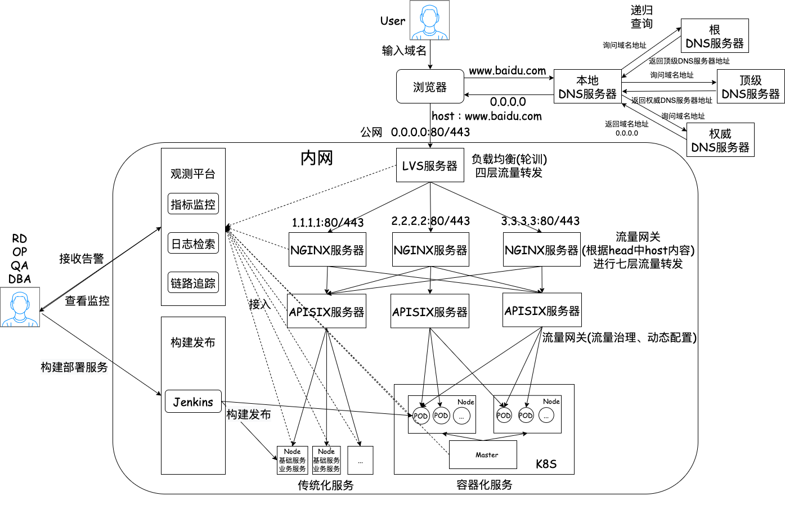

>在浏览器地址栏输入URL，按下回车后究竟发生了什么？ 
>本文还展示了研发人员是如何构建发布用户获取到的Web资源？ 
>该部分为作者梳理的精简内容，希望对您有帮助 ~  

<!--more-->

# 浏览器访问网页的全过程

## 第一步：浏览器输入域名
例如输入：www.baidu.com

## 第二步：浏览器查找域名的IP地址
浏览器会把输入的域名解析成对应的IP，其过程如下：

查找浏览器缓存：因为浏览器一般会缓存DNS记录一段时间，不同浏览器的时间可能不一样，一般2-30分钟不等，浏览器去查找这些缓存，如果有缓存，直接返回IP，否则下一步。

查找系统缓存：浏览器缓存中找不到IP之后，浏览器会进行系统调用（windows中是gethostbyname），查找本机的hosts文件，如果找到，直接返回IP，否则下一步。

查找路由器缓存：如果1,2步都查询无果，则需要借助网络，路由器一般都有自己的DNS缓存，将前面的请求发给路由器，查找ISP 服务商缓存 DNS的服务器，如果查找到IP则直接返回，没有的话继续查找。

递归查询：如果以上步骤还找不到，则ISP的DNS服务器就会进行递归查询，所谓递归查询就是如果主机所询问的本地域名服务器不知道被查询域名的IP地址，那么本地域名服务器就以DNS客户的身份，向其他根域名服务器继续发出查询请求报文，而不是让该主机自己进行下一步查询。（本地域名服务器地址是通过DHPC协议获取地址，DHPC是负责分配IP地址的）

迭代查询：本地域名服务器采用迭代查询，它先向一个根域名服务器查询。本地域名服务器向根域名服务器的查询一般都是采用迭代查询。所谓迭代查询就是当根域名服务器收到本地域名服务器发出的查询请求报文后，要么告诉本地域名服务器下一步应该查询哪一个域名服务器，然后本地域名服务器自己进行后续的查询。（而不是替代本地域名服务器进行后续查询）。

本例子中：根域名服务器告诉本地域名服务器，下一次应查询的顶级域名服务器dns.com的IP地址。本地域名服务器向顶级域名服务器dns.com进行查询。顶级域名服务器dns.com告诉本地域名服务器，下一次应查询的权限域名服务器www.baidu.com的IP地址。本地域名服务器向权限域名服务器dns.baidu.com进行查询。权限域名服务器www.baidu.com告诉本地域名服务器，所查询的主机www.baidu.com的IP地址。本地域名服务器最后把结果告诉主机。

## 第三步 ：浏览器与目标服务器建立TCP连接
主机浏览器通过DNS解析得到了目标服务器的IP地址后，与服务器建立TCP连接。

TCP3次握手连接：浏览器所在的客户机向服务器发出连接请求报文（SYN标志为1）；服务器接收报文后，同意建立连接，向客户机发出确认报文（SYN，ACK标志位均为1）；客户机接收到确认报文后，再次向服务器发出报文，确认已接收到确认报文；此处客户机与服务器之间的TCP连接建立完成，开始通信。

## 第四步：浏览器通过http协议发送请求
浏览器向主机发起一个HTTP-GET方法报文请求。请求中包含访问的URL，也就是http://www.baidu.com/ ，KeepAlive，长连接，还有User-Agent用户浏览器操作系统信息，编码等。值得一提的是Accep-Encoding和Cookies项。Accept-Encoding一般采用gzip，压缩之后传输html文件。Cookies如果是首次访问，会提示服务器建立用户缓存信息，如果不是，可以利用Cookies对应键值，找到相应缓存，缓存里面存放着用户名，密码和一些用户设置项。

## 第五步：某些服务会做永久重定向响应
对于大型网站存在多个主机站点，了负载均衡或者导入流量，提高SEO排名，往往不会直接返回请求页面，而是重定向。返回的状态码就不是200OK，而是301,302以3开头的重定向码，浏览器在获取了重定向响应后，在响应报文中Location项找到重定向地址，浏览器重新第一步访问即可。

重定向的作用：重定向是为了负载均衡或者导入流量，提高SEO排名。利用一个前端服务器接受请求，然后负载到不同的主机上，可以大大提高站点的业务并发处理能力；重定向也可将多个域名的访问，集中到一个站点；由于baidu.com，www.baidu.com会被搜索引擎认为是两个网站，照成每个的链接数都会减少从而降低排名，永久重定向会将两个地址关联起来，搜索引擎会认为是同一个网站，从而提高排名。

## 第六步：浏览器跟踪重定向地址
当浏览器知道了重定向后最终的访问地址之后，重新发送一个http请求，发送内容同上。

## 第七步：服务器处理请求
服务器接收到获取请求，然后处理并返回一个响应。

## 第八步：服务器发出一个HTML响应
返回状态码200 OK，表示服务器可以响应请求，返回报文，由于在报头中Content-type为“text/html”，浏览器以HTML形式呈现，而不是下载文件。

## 第九步：释放TCP连接
浏览器所在主机向服务器发出连接释放报文，然后停止发送数据；

服务器接收到释放报文后发出确认报文，然后将服务器上未传送完的数据发送完；

服务器数据传输完毕后，向客户机发送连接释放报文；

客户机接收到报文后，发出确认，然后等待一段时间后，释放TCP连接；

## 第十步：浏览器显示页面
在浏览器没有完整接受全部HTML文档时，它就已经开始显示这个页面了，浏览器接收到返回的数据包，根据浏览器的渲染机制对相应的数据进行渲染。渲染后的数据，进行相应的页面呈现和脚步的交互。

## 第十一步：浏览器发送获取嵌入在HTML中的其他内容
比如一些样式文件，图片url，js文件url等，浏览器会通过这些url重新发送请求，请求过程依然是HTML读取类似的过程，查询域名，发送请求，重定向等。不过这些静态文件是可以缓存到浏览器中的，有时访问这些文件不需要通过服务器，直接从缓存中取。某些网站也会使用第三方CDN进行托管这些静态文件。

# 后续
## 研发视角
### 可观测行
### 构建发布

# 参考
https://blog.csdn.net/jiao_0509/article/details/82491299