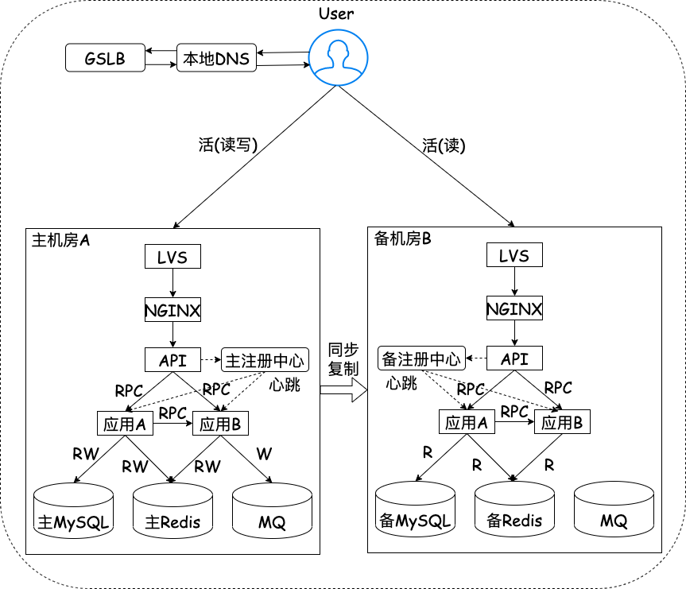

# 分布式系统 —— 容灾架构

>后台服务可以分为两类 : 有状态和无状态。 
>容灾架构对无状态的服务(计算型服务)很简单，不外乎就是多加相同实例；但对有状态服务(存储型服务)就不是那么轻松。 
>下文为作者梳理的容灾架构相关内容，希望对您有帮助 ~  

<!--more-->

## 一、术语介绍
> 说明：
> 1. 在下文中，机房、数据中心、IDC是同义词(统一用机房)
> 2. 在下文中，数据库不仅仅指关系型数据库，还可能是其他类型的数据库

| 术语         | 解释        |
| ----------- | ----------- |
| 冷备         | (需要停机)通过停止数据库对外服务的能力，定时将主数据中心的数据库文件备份到其他数据中心。 当丢失数据时，可以通过冷备回复数据，以保证数据安全。       |
| 双机热备      | (无需停机)通过数据库主从负载或binlog订阅等技术对主数据中心进行实时备份。热备提供实时服务，当主数据中心不可用时，热备可以自动接管业务，保证业务不间断运行，用户端对主备切换无感知        |
| 同城多活      | 同城的数据中心之间物理距离比较近，并且使用专线连接，虽然跨数据中心的访问延迟比单个数据中心内部大，但可接受        |
| 异地多活      | 异地的数据中心之间物理距离较远，网速延迟是不可忽视的因素。比如北京到上海的距离是1300公里，即便架设专线，光纤以光速传输，一个唠会也要10ms。线路之间还有路由器、交换机等设备，实际延迟可达 30ms ~ 100ms，如果网络抖动，延迟可能达到 1s |

> 解释：
> "活"是指实时提供服务的意思；与"活"对应的是字是"备"，备是备份，正常情况下对外是不提供服务的。

## 二、故障分类
| 类别      | 出现原因 | 概率 | 影响面 |
| ----------- | ----------- | ----------- | ----------- |
| 主机故障      | 主机硬件故障、网络故障、负载过高等       | 大 | 小 |
| 机房故障   | 机房网络故障、店里故障、制冷系统故障、自然灾害等。 比如塘沽爆炸事件        | 小 | 大 |
| 地域故障   | 战争、强自然灾害等。比如河南水灾        | 极小 | 极大 |

## 三、同城多活
### 同城双活
同城多活主要是同城双活，架构图如下

## 四、两地三中心(GDPS)
### 两地
两地 ——— 同城、异地 
### 三中心
三中心 ——— 生产中心、同城容灾中心、异地容灾中心

## 五、伪异地多活

## 六、异地双活

## 七、异地多活

## 八、单元化

## 九、数据库架构

# 参考
https://cloud.tencent.com/developer/article/1696857 
https://blog.51cto.com/u_15233911/2872723 
http://timd.cn/distributed-system-disaster-recovery-architecture/ 
https://www.bilibili.com/video/BV18v411c7FX/?spm_id_from=333.337.search-card.all.click&vd_source=984bb0162787242633addc56b07edfb8 
