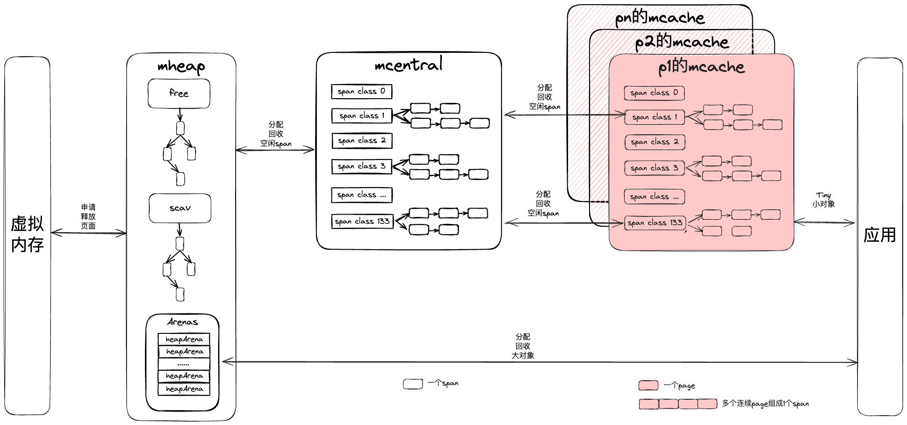

# Golang 底层原理 —— 内存管理

>作者当前认知的Golang内存管理机制 

<!--more-->

# 核心设计思想

**多级内存分配模块 : 减少内存分配时锁的使用与系统调用**

**多尺度内存单元 : 减少内存分配产生的碎片**

# 内存管理分类

**栈内存管理 : 栈上内存由编译器管理**

**堆内存管理 : 堆上内存由程序管理**

注 : 至于一个变量分配在堆上还是栈上，与语法无关，主要依靠golang的逃逸分析

### 两者对比

栈与堆相比劣势

1. 栈空间较小(8M或10M)，不适合存放空间占用大的对象
2. 函数内的局部变量离开函数体会被自动弹出栈，离开函数作用域依然存活的指针也不适合栈存放

栈与堆相比优势

1. 管理简单(由编译器完成)
2. 分配和释放速度快(无垃圾回收过程)
3. 栈上内存有很好的局部性(堆上2块数据可能分部在不同的页上)

# 本文重点 : 堆内存管理

Golang堆内存分配器借鉴了TCMalloc现代分配器的设计思想 

1. 一次性或者提前分配多级内存模块(减少内存分配时锁的使用和调用操作系统分配内存的开销)
2. 多尺度内存单元(减少内存分配产生的碎片)

mspan是堆上内存管理的基本单元，由一连串的页构成(8KB)。Golang根据内存大小将mspan分成67个等级，每个mspan被切分成了很多小对象，用于不同尺度的对象分配。

每个线程有一个独立的堆内存mcache，在mcache上申请内存不需要加锁，每个mache有67种尺度内存单元，每个尺度的内存又由mspan构成，分别存储指针类型和非指针类型。当程序在堆上创建对象时，分配器会根据对象的大小(小于32KB)和类型(是否为指针)从67*2中mspan中分配内存。

如果mcache内存不足，会从**所有线程共享的缓存mcentral**中申请内存。一共有67*2中mcentral，mcache中空间不足的mspan会从对应的mcentral申请内存，申请内存时需要加锁，但是加锁的概率变成了1/(67*2)，申请效率很高。为了进一步提升内存分配效率，每一个mcentral由2个链表构成，一个存放已经分配给mcache的mspan，一个存放未被占用或者已经被mcache释放的mspan。

当mcentral上mspan不足时或者对象大于32KB时会从mheap上申请内存，全局仅有一个mheap，访问时也需要加锁。mheap中有2棵二叉排序树 : free，scav；free存放的是空闲非垃圾回收的mspan，scav存放的是空闲已垃圾回收的mspan。内存分配时会优先从free中搜索可用的span，如果没找到会从scav中搜索可用的span，如果还没找到，会向操作系统申请内存，在重新搜索2棵二叉树，必然能找到可用的span。从操作系统申请的内存也会保存到span中，然后加入free树中。

# 参考
https://www.jianshu.com/p/5641648664d8
