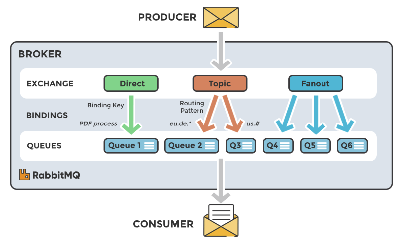

# Kafka 系列

> 为什么选择Kafka?  

<!--more-->

## Why Kafka
消息队列的作用：异步、削峰、解耦

`中小型公司`，技术实力较为一般，技术挑战不是特别高，用RabbitMQ(开源、社区活跃)是不错的选择；`大型公司`，基础架构实力较强，用RocketMQ(Java二次开发)是很好的选择。

如果是`大数据领域`的实时计算、日志采集等场景，用`Kafka`是业内标准，绝对没问题，社区活跃度很高，几乎是全世界这个领域的事实标准。

|      | RabbitMQ | RocketMQ | Kafka |
| ----------- | ----------- | ----------- | ----------- |
| 单机吞吐量    | 1w量级       | 10w量级 | 10w量级         |
| 开发语言      | Erlang      | Java    | Java和Scala    |
| 消息延迟      | 微秒         | 毫秒     | 毫秒    |
| 消息丢失      | 可能性很低    | 参数优化后可以0丢失 | 参数优化后可以0丢失 |
| 消费模式   |    推拉    |    推拉    |   拉取   |
| 主题数量对吞吐量的影响   | \   | 几百上千个主题会吞吐量有一个小的影响 | 几百个主题会极大影响吞吐量 |
| 可用性   | 高(主从)     | 很高(主从) | 高(分布式) |

## RabbitMQ
RabbitMQ开始是用在电信业务的可靠性通信的，也是稍有的几款知识`AMQP`协议的产品之一.
### 优点
- 轻量，方便。
- 支持灵活路由配置。RabbitMQ中，在生产者和队列之间有一个交换器模块。可以灵活地配置路由规则，让生产者发送消息发送到不同的队列中。
- 支持大多数编程语言，支持AMQP协议。

### 缺点
- 如果有大量消息堆积在队列中，性能会急剧下降
- 每秒处理几万到几十万的消息不要选择RabbitMQ
- 由Erlang开发，功能扩展和二次开发代码高

## RocketMQ
借鉴了Kafka的设计并做了很多改进，几乎具备消息队列应有的所有特性和功能。
### 优点
- 主要用于有序，事务，流计算，消息推送，日志流处理，binlog分发等场景
- 性能，可靠性很高(经历多次双11考验)
- Java开发，阅读源代码、扩展、二次开发方便
- 每秒处理几十万的消息，同时响应时间在毫秒级
- 支持死信队列，DLX是一个很有用的特性(可以用来处理异常情况下，消息不能被消费者正确消费而被置入死信队列中的情况，后续分析程序可以通过消费死信队列中的内容来分析当时所遇到的异常情况，进而优化系统)
### 缺点
- 和周边系统的整合和兼容不是很好

## Kafka
高可用，几乎所有相关的开源软件都支持，满足大多数的应用场景，尤其是大数据和流计算领域。
### 优点
- 高效，可伸缩，消息持久化。支持分区、副本和容错
- 对批处理和异步处理做了大量设计
- 每秒处理几十万的异步消息；如果开启压缩，每秒处理消息可达2000w级别
### 缺点
- 由于是异步和批处理，延迟也比较高，不适合电商场景

## 参考
https://www.rabbitmq.com/ 
https://rocketmq.apache.org/ 
https://kafka.apache.org/ 
https://juejin.cn/post/7096095180536676365 
